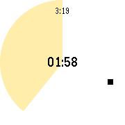
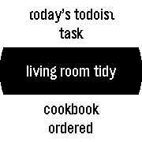

# Limone watchapp

## Description

A simple pomodoro timer for Pebble, to notify 25 minutes work finished and after take 5 minutes break.

About pomodoro, see [The Pomodoro Technique](http://pomodorotechnique.com/) or 
[an article on Wikipedia](https://en.wikipedia.org/wiki/Pomodoro_Technique).

Optionally supports to trigger IFTTT Maker channel and show today's tasks in Todoist.

With [IFTTT Maker Channel](https://ifttt.com/maker) trigger and some Web services,
watchapp will automatically record of your work or notify your state, working or breaking, to someone.

With proper configuration, this feature send a web request to [IFTTT Maker Channel](https://ifttt.com/maker) 
`EventName` (started/canceled/finished), `Value1` task name and `OccurredAt` filled by IFTTT.

|Ingredients|Example               |Notes                                                            |
|-----------|----------------------|-----------------------------------------------------------------|
|EventName  |task_started          |event name for started/canceled/finished depends on configuration|
|Value1     |task                  |task name, able to select from Today's Todoist task              |
|OccurredAt |May 5, 2013 at 11:30PM|Date and time event occurred, filled by IFTTT                    |

Value1 can be filled with task name from Today's tasks in [Todoist](https://todoist.com/)
with Todoist API token in configuration.

screenshots for work/break timer in Aplite, Basalt, Chalk are following.

and screenshots for task select menu in Aplite, Basalt, Chalk

The pebble watchapp name is Limone, because I started pomodoro technique
with a Lemon kitchen timer, not a Tomato one.

## Installation

Limone watchapp is available from [Pebble Appstore](https://apps.getpebble.com/en_US/application/569061bfd5ba00104e000016)

Watchapp PBW files, including latest version unreleased to appstore, or past versions, are 
available from [Github Release](https://github.com/uchida/limone-watchapp).
However, using these version are not recommended, install these versions at your own risk.

## License

Dedicated to .
No rights reserved.
