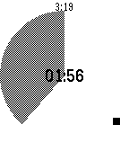
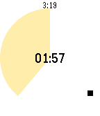

# Limone watchapp

## Description

This is a simple pomodoro timer for Pebble,
to notify 25 minutes work finished and after take 5 minutes break.

About Pomodoro, see [The Pomodoro Technique](http://pomodorotechnique.com/).

screenshots for work/break timer in Aplite, Basalt, Chalk are following.

The pebble watchapp name is Limone, because I started pomodoro technique
with a Lemon kitchen timer, not a Tomato one.

## Installation

Limone watchapp is available from [Pebble Appstore](https://apps.getpebble.com/en_US/application/569061bfd5ba00104e000016)

Watchapp PBW files, including latest version unreleased to appstore, or past versions, are 
available from [Github Release](https://github.com/uchida/limone-watchapp).
However, using these version are not recommended, install these versions at your own risk.

## License

dedicated to .
